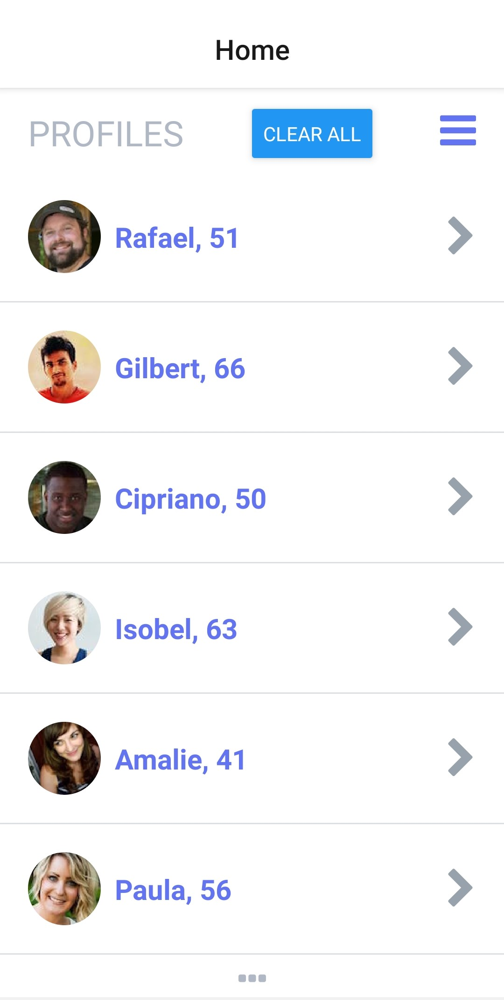

# Wunderful Users

Wunderful users is using an API which generates random user data dynamically and displays to the user. This app also allows you to check user's details such as location,age and gender.

<div >
    
</div>

## Prerequisites

Before you begin, ensure you have met the following requirements:

- You have installed the latest version of Node.js and Expo cli.

## Installing Wunderful Users

```
git clone https://github.com/absolutezero13/wunderful-users.git

```

Open your cloned project file and install the dependencies like this;

```
npm install

```
